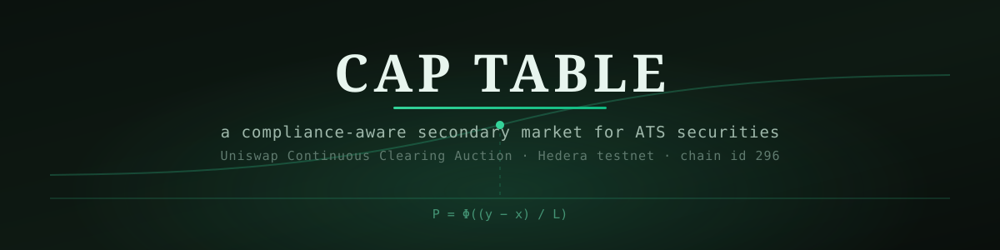
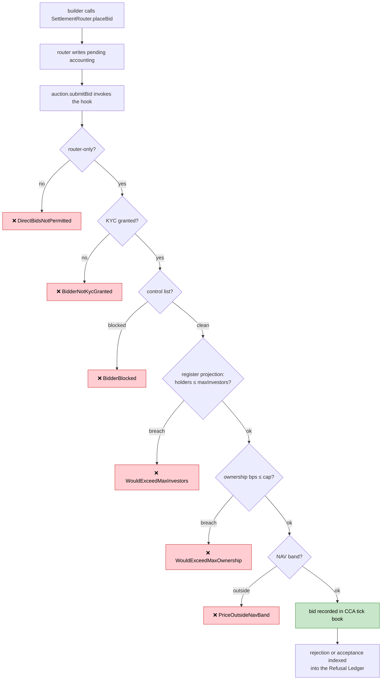
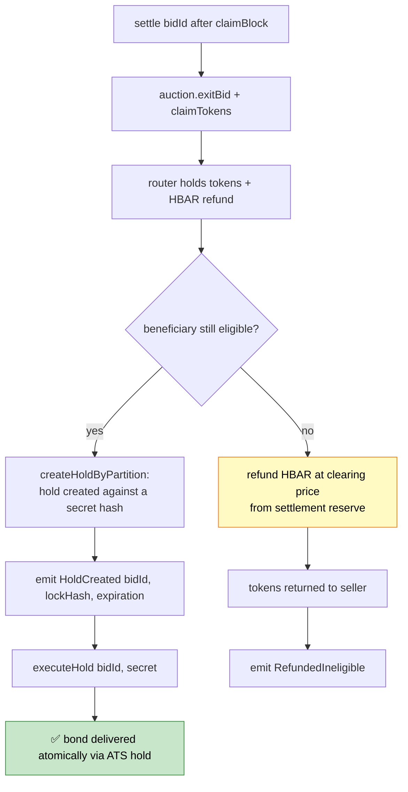
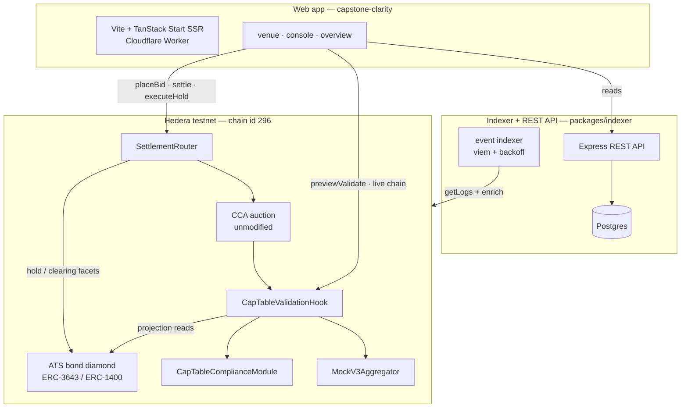

<div align="center">



### The missing venue for compliant securities on Hedera

*Uniswap's Continuous Clearing Auction discovers the price. The register projection keeps it legal. ATS settles the trade.*

[](https://opensource.org/licenses/MIT)
[-34D399?style=flat-square)](https://hashscan.io/testnet)
[](https://soliditylang.org/)
[](https://book.getfoundry.sh/)
[](https://sourcify.dev/)
[](https://vihaan1016-captable-capstone-clarity.vihaan1016.workers.dev)

</div>

---

## 📋 Table of Contents

1. [Description](#-description)
2. [The Problem](#-the-problem)
3. [Live Demo & Deployed Contracts](#-live-demo--deployed-contracts)
4. [The Mechanism](#-the-mechanism)
5. [Settlement: DvP Without Reinventing DvP](#-settlement-dvp-without-reinventing-dvp)
6. [Architecture](#-architecture)
7. [Contract Interfaces](#-contract-interfaces)
8. [Technology Stack](#-technology-stack)
9. [Local Development](#-local-development)
10. [Testing](#-testing)
11. [Deployment](#-deployment)
12. [Gas Measurement](#-gas-measurement)
13. [Feature → Sponsor Criteria](#-feature--sponsor-criteria)
14. [Design Findings](#-design-findings)
15. [Repository Structure](#-repository-structure)
16. [Caveats](#-caveats)
17. [License](#-license)

---

## 📝 Description

**Cap Table** is a compliance-aware secondary market for [Hedera Asset Tokenization Studio](https://hedera.com/asset-tokenization-studio) (ATS) securities, running Uniswap's [Continuous Clearing Auction](https://github.com/Uniswap/v4-periphery) (CCA) — unmodified — as its price-discovery engine on Hedera testnet.

Hedera's prize text says it outright: *"A secondary market for ATS-issued assets, which the Studio does not have today."* Cap Table is that venue. It is a **periodic sell-side auction** — not an order book, not an RFQ, not continuous matching.

Where every gated auction today asks *"is this bidder permitted to hold this token?"*, Cap Table's validation hook asks a different question:

> **"If this bid fills to its worst case, does the resulting shareholder register still satisfy the issuer's compliance rules?"**

Compliance for a security is a property of the **whole register**, not a per-address flag. A permissionless auction with pro-rata fills can turn one large bid into two hundred small holders and silently produce a cap table the issuer cannot legally own. Cap Table refuses to build that register — *before* the bid is signed, not after.

Three things follow:

1. **The register projection.** Every bid is simulated against live investor-count and ownership-concentration limits read from the token's own compliance module. Bids that would breach them revert with a legible, typed error — and the refusal is visible in the UI **before** submission, via a chain-state `previewValidate` call.
2. **ATS-native settlement.** Cleared allocations settle through ATS's own `hold` + `clearing` facets via a settlement router — the auction discovers the price, ATS settles the trade. No raw transfers, no reimplemented DvP.
3. **No stranded bidders.** A compliance-aware claim path refunds any bidder whose eligibility lapsed between bidding and claiming — from a settlement reserve, at the clearing price — instead of freezing their funds forever.

The contracts are deployed and Sourcify-verified on **Hedera testnet (chain id 296)**. The indexer and web app run live (see [Live Demo](#-live-demo--deployed-contracts)).

---

## 🎯 The Problem

### 1. Compliance is a register property, auctions are per-bidder

ATS enforces ERC-3643 compliance **per transfer**: KYC grants, control-list blocks, identity checks. But the issuer's real constraints — a maximum number of investors, a maximum ownership concentration — are properties of the **resulting shareholder register**. An auction that only checks the bidder leaves the register unprotected: one compliant, well-funded bidder can, through pro-rata fills, create dozens of new holders and breach the cap the venue was supposed to enforce.

### 2. Settlement for compliant securities is hold-based DvP

A regulated security cannot settle by raw `transfer` after a clearing price emerges. ATS provides `hold` and `clearing` facets precisely so delivery-versus-payment can happen atomically against escrowed tokens. A venue that ignores them — and just transfers filled tokens to bidders — is not a venue for these assets at all.

### 3. Auction claim paths assume eligibility never lapses

CCA's `claimTokens` performs a raw transfer with **no claim-time compliance re-check**. A bidder who is KYC-granted at bid time but frozen before `claimBlock` either reverts inside ATS compliance (stranding their HBAR) or receives tokens they must not hold. Without an explicit refund path, a filled-but-ineligible bidder's currency is unrecoverable.

### How Cap Table solves them

| Problem | Cap Table's answer |
|---------|--------------------|
| Register breaches from pro-rata fills | `CapTableValidationHook` projects the post-fill register against the compliance module's `maxInvestors` / `maxOwnershipBps` and reverts before the bid is recorded |
| Hold-based settlement | `SettlementRouter.settle` uses `createHoldByPartition` + `executeHoldByPartition` — ATS's own DvP facets — with a secret-reveal leg |
| Eligibility lapse between bid and claim | `settle` re-checks KYC / control-list / compliance and refunds ineligible bidders at clearing from a funded reserve |

---

## 🌐 Live Demo & Deployed Contracts

### Try it now

🚀 **Live app:** [https://vihaan1016-captable-capstone-clarity.vihaan1016.workers.dev](https://vihaan1016-captable-capstone-clarity.vihaan1016.workers.dev)
🔌 **Live indexer API:** [https://captable-production-e19c.up.railway.app/api/health](https://captable-production-e19c.up.railway.app/api/health)
⛓️ **Network:** Hedera testnet, chain id 296 (2-second blocks)

**What to click:** open the venue page, connect a testnet wallet, hit **Get KYC** (self-serve faucet), and place a bid. Watch it be **refused** for a legible regulatory reason — identity, register cap, or NAV band — then watch an eligible bid move the clearing price and settle through an ATS hold.

### Deployed contracts (Hedera testnet)

| Contract | Address | Sourcify |
|---|---|---|
| Bond (ATS diamond, CTDB) | [`0x40dbbB…F19b5aA`](https://hashscan.io/testnet/contract/0x40dbbB7587180F94388ABfDA89303e57aF19b5aA) | facets verified upstream by ATS |
| Auction (CCA, unmodified) | [`0x7d6946…2c02C01`](https://hashscan.io/testnet/contract/0x7d69464Ec69F1413C421188485442f07F2c02C01) | ✓ |
| Validation hook | [`0x1E095a…e6D08`](https://hashscan.io/testnet/contract/0x1E095aF8825497f39694617c0703f4Ea39Fe6D08) | ✓ |
| Settlement router | [`0x63B514…FF319`](https://hashscan.io/testnet/contract/0x63B5149d0525222540A0a43d120209b7068FF319) | ✓ |
| Compliance module | [`0x28815D…Bbb46`](https://hashscan.io/testnet/contract/0x28815D9ffDCb4E8c6c387C4eAAdb02AC418Bbb46) | ✓ |
| NAV aggregator (mock) | [`0x07741F…911Fa`](https://hashscan.io/testnet/contract/0x07741F1afedcC0371C0976F0aFFE7B501F1911Fa) | ✓ |
| CCA factory (unmodified) | [`0xCF4D1A…deb27`](https://hashscan.io/testnet/contract/0xCF4D1A8cFeb27A25e6Fb8c9CC0109FF34dDdeb27) | ✓ |
| Deployer / issuer / seller | `0x479178aEE7ac68C31D64e19Fa08955b791757C6F` | — |

The ATS reference deployment is the Hedera ATS v4.0.0 factory (`0x5fA65CA30d1984701F10476664327f97c864A9D3`) and BLR resolver proxy (`0xEFEF4CAe9642631Cfc6d997D6207Ee48fa78fe42`).

### Current live auction state

| Field | Value |
|---|---|
| Phase | `OPEN` |
| Clearing price | `101.00` (floor) |
| NAV (oracle) | `103.31` |
| Total supply | 1,000,000 raw (10,000.00 bonds) |
| Register | 1 / 50 investor slots used |
| Ownership cap | 1500 bps (15%) |
| Indexer lag | 0 blocks |

### The three refusal beats, on camera

- **Ownership cap — one bid, zero setup.** Supply is 1,000,000 raw at 2 decimals = 10,000.00 bonds; the cap is 1500 bps = 1,500 bonds. Bid 2,000 bonds → `WouldExceedMaxOwnership` (`0x840308b8`), and the console prints `ownershipBps 2000 / 1500`. Narrate it as *the register projection* — that is what it is.
- **Register cap.** The console's `setRules` changes what the hook enforces live — caps are read from the compliance module on **every call**, not cached in constructor immutables. Slide `maxInvestors` down and the next new-holder bid is refused with `WouldExceedMaxInvestors`.
- **NAV band.** `bandBps = 1000` (±10%). Default NAV 103.31 → band 92.98–113.64; bid $130 to trip `PriceOutsideNavBand`. The band **fails open when stale** (`maxStaleness` 3600 s) — push NAV from the console within the hour before recording, or the beat silently vanishes.

A preflight refusal does not stop the demo: **"Submit anyway" broadcasts the bid anyway** with a fixed gas limit, so the refusal is a real reverted transaction on HashScan — not just a staticcall.

---

## ⚙️ The Mechanism

CCA accepts a `validationHook` in its auction configuration. `CapTableValidationHook` implements `IValidationHook` and is invoked inside `submitBid()`. The hook performs eight ordered checks, reverting with a distinct typed error at the first failure:

| # | Check | Error |
|---|---|---|
| 1 | `sender == SETTLEMENT_ROUTER` | `DirectBidsNotPermitted()` |
| 2 | `beneficialOwner != address(0)` | `ZeroBeneficialOwner()` |
| 3 | `kyc.getKycStatusFor(beneficialOwner) == GRANTED` | `BidderNotKycGranted(address)` |
| 4 | control list is not blocking the bidder | `BidderBlocked(address)` |
| 5 | `compliance.canTransfer(auction, bidder, worstCaseFill)` | `TransferWouldFailCompliance(address,uint256)` |
| 6 | Register projection — holder count | `WouldExceedMaxInvestors(uint256,uint256)` |
| 7 | Register projection — ownership share | `WouldExceedMaxOwnership(uint256,uint256)` |
| 8 | NAV deviation band | `PriceOutsideNavBand(uint256,uint256,uint256)` |

### The register projection

Define `worstCaseFill = amount` — a bid clearing fully at its own `maxPrice` receives at most `amount` tokens. The hook then computes:

```
currentHolders  = bond.getTotalSecurityHolders()
isExisting      = totalBalance(bidder) > 0 || router.isPendingBeneficiary(bidder)
projectedHolders= currentHolders + (isExisting ? 0 : 1) + router.pendingNewBeneficiaryCount()

projectedBalance= totalBalance(bidder) + router.pendingAmountFor(bidder) + amount
projectedBps    = projectedBalance × 10_000 / bond.totalSupply()
```

Both projections must respect the compliance module's `maxInvestors` and `maxOwnershipBps`.

Three details make this sound rather than a demo ornament:

- **`pendingNewBeneficiaryCount` is the correctness core.** Without it, N simultaneous bids each individually project `currentHolders + 1`, all pass, then all settle and breach the cap. The router writes pending accounting **before** `submitBid` and the revert rolls it back — which is exactly why the hook is router-only.
- **`AtsBalance.totalOf` closes a fail-open ATS semantic.** ATS `balanceOf` returns *available* balance; a fully-held holder reads as zero and would be counted as a new investor (and their ownership under-counted). `contracts/src/AtsBalance.sol` sums `balanceOf + getHeldAmountFor + getLockedAmountFor` and is used at all four projection sites. This is finding #1 in `FEEDBACK.md`, proven by a fork test.
- **The NAV band fails open.** A stale or reverting oracle **never halts the auction** — the band check is skipped with a loud `NavFeedStale` event after `maxStaleness` seconds.



`previewValidate(maxPrice, amount, beneficialOwner)` runs the **identical** logic as a view and returns `(bool ok, bytes4 reason)` — both paths share one internal function, so they cannot diverge. The `/venue` bid form calls it on every keystroke: **the rejection is visible before the user submits, not after.**

### The exemption list is a design decision, not a workaround

ATS has no custodian/exemption concept; the only cap facets are supply caps. Max-investor / max-ownership limits are `ICompliance` concerns, so Cap Table implements them in `CapTableComplianceModule` and exempts the auction and settlement router from *per-holder* caps so the custody legs (seller → auction → router) can move the whole supply. This was confirmed as the intended integration pattern with the ATS team.

---

## 🤝 Settlement: DvP Without Reinventing DvP

CCA discovers the price; **ATS settles the trade**. `SettlementRouter.settle` never raw-transfers the bond to a beneficiary:



- **Delivery leg:** `createHoldByPartition(DEFAULT_PARTITION, beneficiary, tokensFilled, expiration, lockHash)` → the router is the holder of record, so it may create holds. `executeHoldByPartition(id, beneficiary, tokensFilled)` reveals the secret and transfers the bond atomically. ATS's hold struct has no hash field (finding #2), so the secret hash rides in the hold's `data`.
- **Refund leg:** if the beneficiary became ineligible between bidding and settling, the router refunds `tokensFilled × clearingPrice` in HBAR from a settlement reserve and returns the unclaimable tokens to the seller. If the reserve is underfunded, `settle` reverts `ReserveUnderfunded(needed, have)` — the failure is loud and retryable, never a silent stranding.

---

## 🏗️ Architecture



| Component | Language | Purpose |
|-----------|----------|---------|
| `CapTableValidationHook` | Solidity | The core deliverable. Eight ordered checks, register projection + NAV band, `previewValidate`. |
| `SettlementRouter` | Solidity | Only permitted `submitBid` caller; beneficial-ownership records; ATS hold-based DvP + ineligible refunds. |
| `CapTableComplianceModule` | Solidity | Investor-count and ownership-concentration rules behind `ICompliance`. |
| `AtsBalance` | Solidity | Total-balance reads (`balanceOf + held + locked`) — closes the fail-open projection bug. |
| `MockV3Aggregator` | Solidity | Chainlink `AggregatorV3`-compatible NAV feed. |
| Indexer | TypeScript | Event indexer over auction + ATS events → Postgres → REST. |
| Web app | TypeScript | SSR auction venue, live cap-table projection, bid/claim/settle write paths. |

---

## 🔗 Contract Interfaces

```solidity
// CapTableValidationHook — implements IValidationHook (unmodified interface)
function validate(uint256 maxPrice, uint128 amount, address owner, address sender, bytes calldata hookData) external;
function previewValidate(uint256 maxPrice, uint128 amount, address beneficialOwner)
    external view returns (bool ok, bytes4 reason);
function registerState() external view
    returns (uint256 holders, uint256 maxInvestors, uint256 largestBps, uint256 maxOwnershipBps);

// SettlementRouter — the only permitted bid submitter
function placeBid(uint256 maxPriceQ96, uint128 amount, uint256 prevTickPriceQ96)
    external payable returns (uint256 bidId);
function exitBid(uint256 bidId) external;
function settle(uint256 bidId) external;
function executeHold(uint256 bidId, bytes32 secret) external;
function fundReserve() external payable;

// CapTableComplianceModule — implements ICompliance
function canTransfer(address from, address to, uint256 amount) external view returns (bool);
function setRules(uint32 maxInvestors, uint16 maxOwnershipBps) external;
```

`hookData` decodes as `abi.decode(hookData, (address beneficialOwner, bytes32 nonce))` — the hook validates the **beneficial owner**, never `owner` (which is always the router).

**REST API highlights** (all numerics are decimal strings, never floats):

| Route | Purpose |
|-------|---------|
| `GET /api/auction/:address` | Phase, clearing price, NAV, supply released, graduation state |
| `GET /api/auction/:address/book` | Tick book with cumulative demand and the clearing tick |
| `GET /api/bond/:address/register` | **The cap-table panel**: holders / max, largest bps, pending beneficiaries |
| `GET /api/auction/:address/rejections` | **The Refusal Ledger**: decoded error name + human reason per rejection |
| `GET /api/bid/:bidId` | Full bid state machine + `REFUNDED_INELIGIBLE` reason |
| `GET /api/deployment` | The live address table (served from `deployments/hedera-testnet.json`) |
| `POST /api/faucet/kyc` | Self-serve demo KYC (rate-limited, issuer-key scoped) |
| `GET /api/health` | `{ ok, headBlock, lagBlocks }` |

The **rejections table is a first-class product**, not a log — the demo and the README both read from it.

---

## 🚀 Technology Stack

| Layer | Technology |
|-------|------------|
| Contracts | Solidity ^0.8.24, Foundry (forge, cast), raw ABI drives of ATS facets |
| Price discovery | Uniswap Continuous Clearing Auction — deployed and used **unmodified** |
| Token | ATS bond (ERC-3643 / ERC-1400 diamond), decimals 2, native HBAR auction currency |
| Oracle | Chainlink `AggregatorV3`-compatible NAV feed (mock on testnet) |
| Indexer | TypeScript, `viem`, Postgres, Express |
| Web app | Vite, TanStack Start (SSR), `wagmi` + `viem`, Tailwind |
| Hosting | Railway (indexer + Postgres), Cloudflare Workers (frontend) |
| Network | Hedera testnet, chain id 296, 2-second blocks |

---

## 🛠️ Local Development

### Prerequisites

- **Foundry** (forge, cast) — `curl -L https://foundry.paradigm.xyz | bash`
- **Node.js ≥ 20** + **pnpm**
- **Bun** (frontend; or use `npm`)
- **Postgres** (Docker for `docker compose`, or any local instance)

### Quick start

```bash
pnpm install

# Postgres for the indexer
docker compose up -d

# Contracts
forge test          # 30 tests (2 fork-only, guarded to chain id 296)
forge build

# Indexer + API (defaults: localhost:8080, Postgres at 127.0.0.1:5432)
cd packages/indexer
INDEXER_START_BLOCK=40268351 pnpm dev

# Web app
cd capstone-clarity
VITE_INDEXER_API=http://localhost:8080 bun run dev
```

The schema applies itself at indexer boot (`packages/indexer/sql/schema.sql` is idempotent) — no manual migration.

---

## 🧪 Testing

```
Ran 9 test suites: 30 tests passed, 0 failed, 0 skipped
```

### The four adversarial cases (all tested)

1. **Concurrent holder-cap race** — 49 of 50 slots used, five new bidders in one block: exactly one succeeds, four revert `WouldExceedMaxInvestors`. (`contracts/test/RegisterProjection.t.sol`)
2. **Bidder frozen between bid and claim** — refunded at clearing from the settlement reserve, tokens returned to seller, state `REFUNDED_INELIGIBLE`, with the naive stranding failure asserted alongside. (`contracts/test/SettlementRouter.t.sol`)
3. **Reserve underfunded** — `settle` reverts `ReserveUnderfunded(needed, have)` and leaves state unchanged. (`contracts/test/SettlementRouter.t.sol`)
4. **`owner`/`sender` bypass** — a KYC-granted account calling `auction.submitBid` directly reverts `DirectBidsNotPermitted` before any compliance read. (`contracts/test/CapTableValidationHook.t.sol`)

Plus: `AtsRegisterSemantics.t.sol` reproduces the `balanceOf`-vs-total-balance fail-open against the **deployed** ATS bond on a fork, and `DemoBeats.t.sol` proves the five demo beats end-to-end against live testnet state:

```bash
forge test --match-path contracts/test/DemoBeats.t.sol \
  --fork-url https://testnet.hashio.io/api -vv
```

---

## 📦 Deployment

Contracts are deployed and Sourcify-verified (see the table above). State and addresses live in `deployments/hedera-testnet.json` (tracked; addresses and flags only — no keys).

| Component | Path | Target | Live URL |
|---|---|---|---|
| Indexer + API | `packages/indexer/` | Railway | `captable-production-e19c.up.railway.app` |
| Postgres | Railway plugin | Railway | injected via `DATABASE_URL` |
| Web app | `capstone-clarity/` | Cloudflare Workers | `vihaan1016-captable-capstone-clarity.vihaan1016.workers.dev` |

### Backend (Railway)

```bash
cd packages/indexer
railway init                        # deploy from GitHub repo; root dir "/", Dockerfile packages/indexer/Dockerfile
railway add --database postgres     # DATABASE_URL + PORT injected automatically
railway variables set \
  HEDERA_RPC=https://testnet.hashio.io/api \
  HEDERA_RPC_FALLBACK=https://testnet.arkhia.io/api \
  INDEXER_START_BLOCK=40268351 \
  FAUCET_ENABLED=true
railway variables set ISSUER_PRIVATE_KEY=<key>   # secret, never committed
railway up
```

`INDEXER_START_BLOCK` must precede the auction's `AuctionCreated` event (creation block `40268451`; `40268351` = minus 100). `FAUCET_ENABLED=true` + `ISSUER_PRIVATE_KEY` power the self-serve **Get KYC** button.

The `.railwayignore` at the repo root excludes `capstone-clarity/`, `contracts/`, and `.research/` — without it, the `contracts/lib/*` symlinks into the gitignored vendor research tree drag ~400 MB into the upload.

### Frontend (Cloudflare Workers)

```bash
cd capstone-clarity
VITE_INDEXER_API=https://captable-production-e19c.up.railway.app bun run build
npx wrangler deploy
```

The production build **fails loudly** without `VITE_INDEXER_API` (guard in `capstone-clarity/vite.config.ts`) — the `localhost:8080` dev fallback can never ship silently.

### Redeploying contracts (optional — already live)

```bash
forge script contracts/script/DeployCapTable.s.sol \
  --rpc-url $HEDERA_RPC --private-key $DEPLOYER_PRIVATE_KEY --broadcast -vvvv
```

The script is **idempotent**: re-running against the live state file skips completed steps (`SKIP`/`EXEC` per step). Issuance (`deployBond`, mint, role grants) is script-driven by design — the browser never holds an issuance-capable key.

---

## ⛽ Gas Measurement

Measured with `forge test --match-path contracts/test/GasMeasurement.t.sol -vv` against the real CCA and ATS adapters.

| Path | Gas |
|---|---|
| `submitBid` without hook | 353,438 |
| `submitBid` with validation hook | 623,628 |

The hook adds ~270k gas — the cost of eight compliance checks, four ATS diamond delegatecall reads, and the register projection, with caps read **live** from the compliance module on every call (so console rule changes apply without redeployment).

---

## 🏆 Feature → Sponsor Criteria

**Hedera — Tokenization of Anything (anchor).** Cap Table provides the *secondary market for ATS-issued assets, which the Studio does not have today*:

- Issuance uses the deployed ATS factory (`deployBond`), `contracts/script/DeployCapTable.s.sol:229`.
- KYC/SSI sequence follows the exact order ATS requires (`grantRole(ROLE_SSI_MANAGER) → addIssuer → grantKyc`), `contracts/script/DeployCapTable.s.sol:243`.
- Settlement uses ATS's own hold-by-partition facets (not a raw transfer), `contracts/src/SettlementRouter.sol:289` (`createHoldByPartition`) and `contracts/src/SettlementRouter.sol:197` (`executeHoldByPartition`).

**Uniswap Foundation — Best Uniswap Stack Contribution (native extension).** CCA is deployed and used **unmodified**; the contribution is a validation hook and a settlement router that compose with it:

- `CapTableValidationHook` implements `IValidationHook`, `contracts/src/CapTableValidationHook.sol:122`.
- `SettlementRouter` is the only permitted `submitBid` caller — enforced in the hook, not the router, `contracts/src/CapTableValidationHook.sol:163` (`DirectBidsNotPermitted`).
- The hook projects the register before accepting a bid, preventing pro-rata fills from silently breaching investor caps, `contracts/src/CapTableValidationHook.sol:186`.

**Chainlink (flex).** `MockV3Aggregator` supplies the NAV feed (`contracts/src/MockV3Aggregator.sol`); the hook enforces a configurable NAV deviation band with a stale-oracle skip path, `contracts/src/CapTableValidationHook.sol:228`.

---

## 🔍 Design Findings

Fourteen load-bearing findings against the real upstream contracts are recorded in [`FEEDBACK.md`](FEEDBACK.md). The three required by the submission brief:

1. **`balanceOf` returns available balance, not total** — a fully-held holder reads as zero, so the obvious projection fails open. Closed with `AtsBalance.totalOf`, proven by a fork test.
2. **CCA's Permit2 dependency has no `transferFrom` fallback** — sidestepped with native HBAR currency (`currency = address(0)`).
3. **There is no claim-time compliance re-check** — `SettlementRouter.settle` re-checks eligibility and refunds ineligible bidders from a reserve.

Two honest design findings stated rather than hidden:

- **CCA graduation is not used as an LBP gateway.** An ERC-3643 token cannot live in a permissionless pool — every swap to an unverified address reverts. `requiredCurrencyRaised` is used purely as a reserve price; `lbpInitializationParams()` is never called.
- **The NAV band fails open on staleness.** A broken oracle must never halt the auction — but a silent skip is a compliance guard quietly disappearing, so the hook emits `NavFeedStale` and the UI flags it.

---

## 📁 Repository Structure

```
captable-public/
├── contracts/                        # Foundry project
│   ├── src/
│   │   ├── CapTableValidationHook.sol    # the core deliverable
│   │   ├── SettlementRouter.sol          # DvP settlement + refunds
│   │   ├── CapTableComplianceModule.sol  # investor-count / ownership caps
│   │   ├── AtsBalance.sol                # total-balance reads
│   │   ├── MockV3Aggregator.sol          # NAV feed
│   │   ├── PriceQ96.sol / Isin.sol       # numeric + ISIN helpers
│   │   └── ats/                          # adapter interfaces for deployed ATS facets
│   ├── test/                         # 30 tests, 4 adversarial + fork tests
│   ├── script/DeployCapTable.s.sol   # idempotent issuance/KYC/auction script
│   └── config/bond.testnet.json      # bond parameters
├── packages/
│   ├── indexer/                      # TypeScript indexer + REST API + Postgres schema
│   └── shared/                       # ISIN generator, shared types
├── capstone-clarity/                 # Vite + TanStack SSR web app (venue, console)
├── deployments/hedera-testnet.json   # live addresses + flags (tracked, no keys)
├── CAPTABLE-SPEC.md                  # the full technical specification
├── FEEDBACK.md                       # upstream findings (sponsor deliverable)
└── docker-compose.yml                # dev Postgres
```

---

## ⚠️ Caveats

- **Testnet only** (chain id 296, 2-second blocks). Mainnet is out of scope.
- **Native HBAR auction currency** — no Permit2 dependency, no ERC-20 payment path.
- **Periodic sell-side auction** — no two-sided order book, RFQ, or continuous matching.
- **Single ATS partition** (the ATS default, `bytes32(uint256(1))`).
- **Mock NAV aggregator** — swap in a real feed with `--real-feed <address>` at deploy time.
- **Owner-controlled resolver** — a real oracle integration is future work.
- The deployer account must be funded and KYC-granted; the seller must hold the bond total supply before auction creation.
- `ISSUER_PRIVATE_KEY` lives only in Railway env — never in the repo, a Dockerfile, or a build log. It is testnet-only and scoped to one demo bond (grant KYC, nothing else).

---

## 📄 License

This project is licensed under the **MIT License**.

```
MIT License

Copyright (c) 2026 Cap Table

Permission is hereby granted, free of charge, to any person obtaining a copy
of this software and associated documentation files (the "Software"), to deal
in the Software without restriction, including without limitation the rights
to use, copy, modify, merge, publish, distribute, sublicense, and/or sell
copies of the Software, and to permit persons to whom the Software is
furnished to do so, subject to the following conditions:

The above copyright notice and this permission notice shall be included in all
copies or substantial portions of the Software.

THE SOFTWARE IS PROVIDED "AS IS", WITHOUT WARRANTY OF ANY KIND, EXPRESS OR
IMPLIED, INCLUDING BUT NOT LIMITED TO THE WARRANTIES OF MERCHANTABILITY,
FITNESS FOR A PARTICULAR PURPOSE AND NONINFRINGEMENT. IN NO EVENT SHALL THE
AUTHORS OR COPYRIGHT HOLDERS BE LIABLE FOR ANY CLAIM, DAMAGES OR OTHER
LIABILITY, WHETHER IN AN ACTION OF CONTRACT, TORT OR OTHERWISE, ARISING FROM,
OUT OF OR IN CONNECTION WITH THE SOFTWARE OR THE USE OR OTHER DEALINGS IN THE
SOFTWARE.
```

---

## 🙏 Acknowledgments

- **Uniswap Labs** — for the Continuous Clearing Auction and the validation-hook extension point that made this composition possible without a fork
- **Hedera & the ATS team** — for Asset Tokenization Studio and for confirming the exemption-list integration pattern
- **Chainlink** — for the `AggregatorV3` standard the NAV band is built against
- **The ATS builder community** — findings #2 and #3 in `FEEDBACK.md` were surfaced by other builders in the ATS holds thread and reproduced with attribution

## 🔗 Resources

- **Live app:** [https://vihaan1016-captable-capstone-clarity.vihaan1016.workers.dev](https://vihaan1016-captable-capstone-clarity.vihaan1016.workers.dev)
- **Live API:** [https://captable-production-e19c.up.railway.app/api/health](https://captable-production-e19c.up.railway.app/api/health)
- **Specification:** [`CAPTABLE-SPEC.md`](CAPTABLE-SPEC.md)
- **Upstream findings:** [`FEEDBACK.md`](FEEDBACK.md)
- **Hedera ATS docs:** [https://github.com/hashgraph/asset-tokenization-studio](https://github.com/hashgraph/asset-tokenization-studio)
- **CCA source:** [https://github.com/Uniswap/v4-periphery](https://github.com/Uniswap/v4-periphery)

---

**Built for ETHGlobal ETHOnline 2026 · Hedera testnet · chain id 296**
